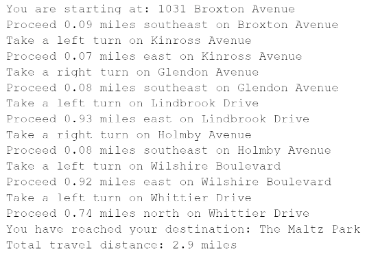

# BruinNav

BruinNav is a simple navigation system that loads and indexes a bunch of Open Street Map geospatial data consisting of latitudes and longitudes of thousands of streets and attractions then uses them to build a turn-by-turn navigation system on top of this data.

My solution implements A* Search Algorithmn for pathfinding and utilizes my implementation of an AVL Tree, a self-balancing binary search tree. An AVL Tree was used over a regular binary search tree to guarantee worst case O(logn) time complexity for searching, insertions, and deletions. 
When you have data such as geospatial coordinates from Open Street Map data, it is very likely that the data will be sorted in some way.
In a regular binary search tree, the worst case time complexity for these processes are actually O(n), which occurs when the data is sorted (or reverse sorted). In such a case, a binary search tree actually has the structure of a linked list.
